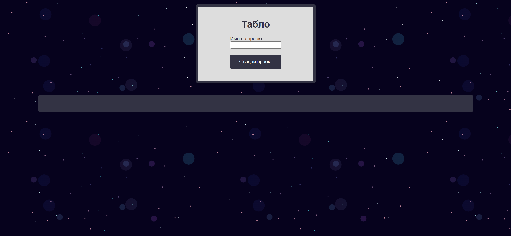
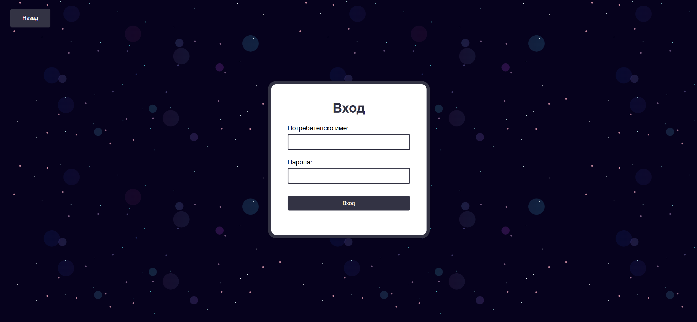
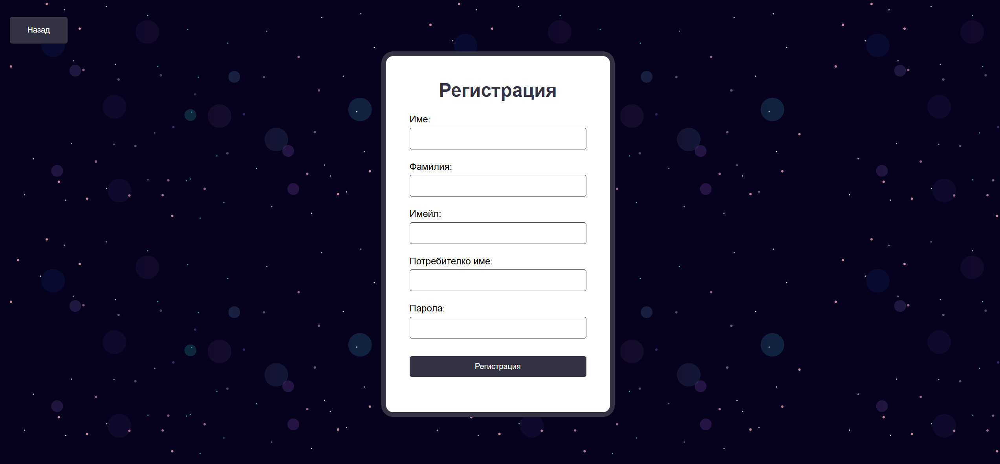
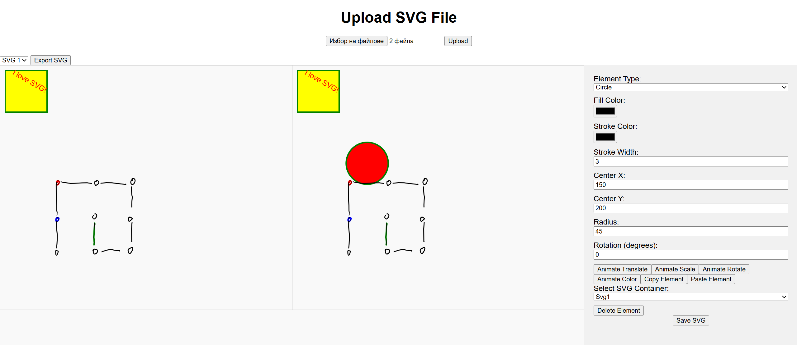

🎨 Animating SVG - Web-Based SVG Animation Tool

🌟 Project Overview

Animating SVG is a web-based platform that enables users to create, animate, and edit SVG files effortlessly. The system provides an intuitive UI and various animation tools, making SVG animation accessible for everyone. Users can register, log in, upload, modify, and save animated SVG projects. The system stores user data securely in a MySQL database and ensures smooth performance through PHP and JavaScript integration.

Developed in collaboration with Hristina Gadzheva

✨ Features

✅ User Authentication - Register/Login functionality with secure data storage✅ SVG File Management - Upload, modify, and save multiple SVG projects✅ Animation Effects - Scale, rotate, translate, change colors, and more✅ Frame Exporting - Save animated frames for further processing✅ Project Dashboard - Manage ongoing projects with an easy-to-use interface✅ Database Integration - Stores user data, files, and animations securely

📌 Technologies Used

Frontend: HTML, CSS, JavaScript

Backend: PHP (with MySQL database)

Server: XAMPP (for local development)

SVG Handling: JavaScript-based manipulation

🛠 Installation & Setup

🔹 Prerequisites

Install XAMPP (Version 10 or later)

Place project files inside C:\xampp\htdocs

🔹 Database Setup

Open phpMyAdmin (via XAMPP control panel)

Create a new database (e.g., svg_animation)

Run the provided SQL script (DatabaseSetup.txt) to set up the necessary tables

🔹 Running the Project

Start Apache and MySQL services in XAMPP

Open your browser and navigate to http://localhost/Animating-SVG

Register or log in to start using the platform

🖥️ UI Preview

### 🏠 Dashboard

### 🔑 Login Page

### 📝 Registration Page

### 🎨 SVG Editor

📁 Project Structure

Animating-SVG/
│-- index.html       # Homepage structure
│-- index.css        # Homepage styling
│-- index.js         # Homepage functionality
│
-- # Registration page
│   ├── registration.html
│   ├── registration.css
│   ├── registration.js
│   ├── registration.php
│
-- # Login page
│   ├── login.html
│   ├── login.css
│   ├── login.js
│   ├── login.php
│
-- # User project dashboard
│   ├── dashboard.html
│   ├── dashboard.css
│   ├── dashboard.js
│   ├── dashboard.php
│
-- # SVG Editing functionality
│   ├── svgEdit.html
│   ├── svgEditStyles.css
│   ├── svgEdit.php
│   ├── modifySVG.js
│   ├── uploadSVG.js
│   ├── uploadSVG.php
│   ├── exportSVG.js
│   ├── exportAnimationFrames.js
│
│-- config.php       # Configuration settings
│-- DatabaseSetup.txt # SQL script for database setup

🛠 Future Improvements

🚀 Add more animation presets
🎵 Integrate sound effects
🖼 Improve UI design and interactivity
📂 Enable cloud storage for projects
